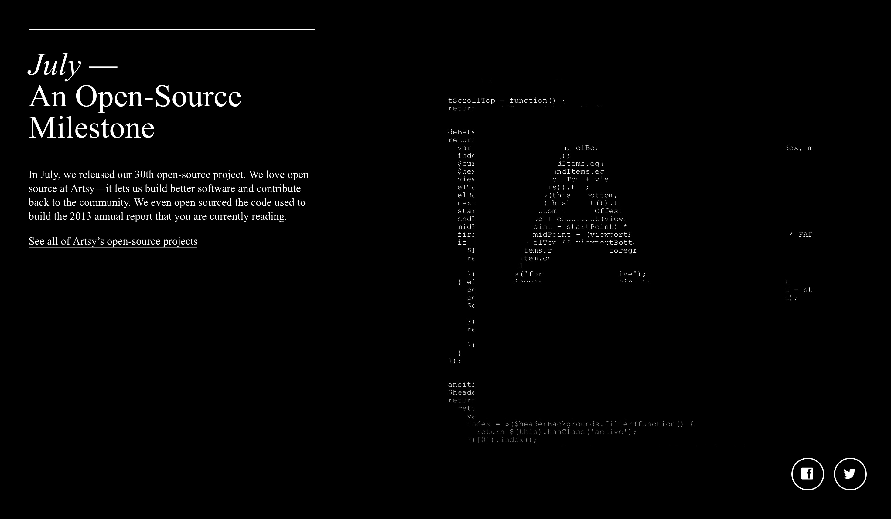

# 2013.ARTSY.NET

## About

The [2013.artsy.net](http://2013.artsy.net) static site using [Node.js](http://nodejs.org/) for some preprocessors.

## Getting Started

1. Install [Node.js](http://nodejs.org/)
2. Install node modules `npm install`
3. Edit in development mode `make s` and open [localhost:3000](http://localhost:3000)
4. Generate the static site under /out `make generate`

Optionally...

* Install [imagemagick](http://www.imagemagick.org/script/index.php) and generate responsive images `make images`
* Deploy to production based on S3 credentials stored in your env variables `make deploy`

## Content Images

Currently the image contents are not checked under git. If you are working at Artsy you can download the images from our S3 bucket. Otherwise you'll just have to download them off 2013.artsy.net yourself, or add your own place-holders with file names relative to what's pointed at under src/templates/content.

Additionally there is a `make images` task to resize these images. To use this install imagemagick, place your images under the out/_content folder, and run the `make images` task.

## Overview

Artsy 2013 is a static site that uses [stylus](http://learnboost.github.io/stylus/), [jade](http://jade-lang.com/), [coffeescript](http://coffeescript.org/), and [browserify](http://browserify.org/) to make development easier. All of the source files are found under /src and a Makefile has a couple tasks to output the site for production use.

The majority of the code can be found under src/scripts/index.coffee. In here, scroll-driven animations are set up through a set of functions wrapped up in an `onScroll` function. Because supporting scroll events on iPad is crazy, we're using [iScroll](https://github.com/cubiq/iscroll) if we detect an iPad device, while using the more traditional `$(window).on('scroll')` for desktop browsers. This means we have to wrap a lot of code like `$(window).scrollTop()` in our own utility functions that calculate based on iscroll or `window` depending on the device.

A combination of responsive and device detection is used to support the most common devices (desktop browser, iPhone, iPad). Responsive media queries pertaining to mobile devices can be found in src/stylesheets/mobile, as well as non-mobile specific media queries found among their respective component stylesheets. The src/scripts/index.coffee file has some device detection based on `window.navigator.userAgent`. On load we add classes to the body indicating things like `ios6`. Along-side the troublesome CSS selectors in our stylus files we will target the offenders via `body.ios6 #offending .class`.

## Contributing

This is mostly just an example project for learning's sake, but if you would still like to contribute simply fork the project and submit a pull request.

## License

MIT
